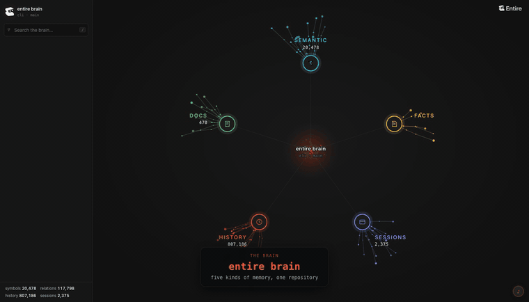

# Entire Brain

Every developer builds on what came before: code written, ideas discussed, lessons learned, decisions made, feedback received, and failures understood. Our agents are trained on the world’s knowledge, but they lack the memory of how our projects got here. Entire Brain brings that experience forward, giving agents the context they need to start informed and build on prior work.

Entire Brain combines captured agent sessions and checkpoints with durable facts, documentation, and code understanding from [Entire Graph](https://github.com/entireio/entire-graph). Graph maps how the code fits together; Brain connects that structure to why it exists, what happened before, and how to approach similar work.

Through the CLI and MCP, agents can retrieve earlier decisions, revisit past attempts and their outcomes, assemble context for a task, and turn reviewed lessons into reusable skills. Knowledge stays linked to its supporting evidence, so it can be checked, revised, and applied as the project evolves.

## Features

- Give an agent relevant decisions, code locations, and suggested tests before it starts a task.
- Save project facts by hand or extract them from past sessions, then check their source references against the repository.
- Search facts, history, documentation, and conversations by keyword or meaning.
- Find code, inspect the impact of a change, and investigate regressions with [Entire Graph](https://github.com/entireio/entire-graph).
- Connect agents through the CLI or MCP, with response size limits and repository instructions.
- Browse saved knowledge in a terminal dashboard or an offline graph view.
- Brain reads sessions captured by Entire CLI and uses Entire Graph for code analysis. Without captured sessions, Brain builds from code, docs, and Git history.
- Graph is required for code analysis, but you can use Brain to search sessions, docs, and facts without it.

## Install

Brain is a plugin for the Entire CLI. Install the CLI first if you do not have
it:

```sh
curl -fsSL https://entire.io/install.sh | bash
```

Then install Brain, and Graph alongside it:

```sh
entire plugin install graph
entire plugin install brain
```

Graph supplies the code analysis Brain builds on. Brain runs without it — you
can still search sessions, documentation, and facts — but `setup` will report
the semantic index as unavailable until Graph is installed.

Confirm both:

```sh
entire brain version && entire graph version
```

### Or one command, without the CLI

If you would rather not install the CLI first, this does the whole thing on its
own — downloads the release binary for your platform, verifies it against the
release checksums, installs it to `~/.local/bin`, and registers it:

```sh
curl -fsSL https://raw.githubusercontent.com/entireio/entire-brain/main/scripts/get-brain.sh | bash
```

Brain's default build is pure Go, so there is no Go toolchain and no C compiler
to install. Add `--nightly` for the nightly channel, `--version vX.Y.Z` to pin a
release, or `--dir <path>` to install elsewhere. Windows users can take the
`.zip` from the [latest release](https://github.com/entireio/entire-brain/releases/latest).

<details>
<summary>Building from source instead</summary>

Needs Go 1.27 or later, Git 2.36 or later, the Entire CLI on `PATH`, and a C
compiler for Graph's tree-sitter bindings.

```sh
git clone https://github.com/entireio/entire-brain.git
cd entire-brain
./scripts/install.sh
```

The installer builds and registers Brain and Graph, writes the default plugin
configuration, and runs a health check. It does not initialize a repository's
memory or install the watcher.

</details>

See [installation options](docs/operations.md#full-install) for choosing a Graph checkout, installing offline, or building Brain alone.

## Activate it for your agent

Brain is set up is per [repository](docs/reference.md#3a-what-setup-needs-first-and-what-it-does-not). Start in a local Git repository with at least one commit:

```sh
entire brain setup
```

By default, `setup` indexes the repository, extracts facts from up to 25 past sessions in the background, and installs a watcher to keep the memory updated. The watcher runs as a persistent service on macOS and Linux with systemd.

Now install the agent instructions:

```sh
entire brain init-agents
```

The command creates or updates these files:

- `.entire/agent-guide.md`: the agent instructions. Rerunning the command replaces this file.
- `AGENTS.md` and `CLAUDE.md`: references to the guide inside managed blocks. Your text outside those blocks is preserved.

Review the generated files and commit them together when the instructions should apply to your team. When Graph is installed, the guide tells agents to use Brain for prior decisions and Graph to locate and inspect code. Restart your agent or reload its repository instructions so it picks up the guide.

For an MCP client, print this repository's configuration:

```sh
entire brain mcp --print-config
```

Then register it with an MCP-capable client, for example for Claude Code:

```bash
claude mcp add entire-brain -- entire brain mcp
```

Add that configuration to your client. See the [agent integration guide](docs/reference.md#how-agents-use-the-brain) and [coordination contract](docs/agent-coordination.md) for setup details.

### Brain without fact extraction

Extracting facts uses an available agent CLI and can send session content to its model provider and incur token charges. Without an agent CLI, this step is skipped. 

To build without fact extraction or a background service, use:

```sh
entire brain setup --no-backfill --no-daemon
```

Configured remote history sources and publishing also use the network; see [privacy and egress](docs/reference.md#privacy-and-egress) for controls.

## What to ask

Ask your coding agent in plain language, or run the Brain commands directly.

| Goal | Example prompt | Brain command |
| --- | --- | --- |
| Start a task | What should I know before changing the retry policy? | `brief` |
| Understand the project | Summarize this project's structure and conventions. | `overview` |
| Recover prior decisions | Why did we remove the queue abstraction? | `query` |
| Find saved facts | What do we know about retry limits? | `recall` |
| Check saved facts | Check whether the sources for our saved facts still match the repository. | `verify` |
| Inspect memory health | Which sources are missing or out of date? | `status` |

## Usage Examples

### Check what the brain knows

```bash
# One-line health and coverage summary.
entire brain status

# The full picture: sources, freshness, blind spots.
entire brain status --verbose

# What is this project? Stack, boundaries, commands, recent decisions.
entire brain overview
```

### Record and retrieve facts

```bash
# Author a durable fact about this repository.
entire brain remember "Retries are capped at 3; the 4th failure must page."

# Retrieve facts for the current branch.
entire brain recall "retry policy"

# Re-check every fact's anchors against the current tree.
entire brain verify
```

### Search

```bash
# Lexical (BM25 over history and docs, token overlap over facts).
entire brain query --keyword "rate limiter"

# Vector / semantic.
entire brain query --semantic "how do we handle backpressure"

# Hybrid: lexical + vector, fused with RRF. Usually the one you want.
entire brain query "why did we drop the queue abstraction"
```

Supply the query text positionally or with `--query`; flags can appear before or after it:

```bash
entire brain query --keyword --query "RetryPolicy"
entire brain query --query "handling temporary failures" --semantic
```

The default mode is hybrid. `--keyword` and `--semantic` are mutually
exclusive; supplying both a positional query and `--query` is an error.
The same forms work with `entire brain workspace query <workspace>`.

`query` also takes `--source` (`all` | `fact` | `history` | `doc` | `conversation`) to narrow the corpus, and `--json` for machine-readable output:

```bash
entire brain query "auth middleware" --source fact --json | jq '.results[0]'
```

### Navigate the code semantically

```bash
# What does changing this symbol affect?
entire brain inspect impact --symbol ValidateToken

# What is unreachable?
entire brain inspect dead-code --json

# What changed since the brain was last indexed?
entire brain inspect changes
```

### Build a task packet for an agent

```bash
# A bounded context packet scoped to one task.
entire brain brief "add rate limiting to the upload endpoint"
```

### Explore the brain interactively

```bash
entire brain dash   # TUI: status, facts, sessions, history, semantic
entire brain viz    # offline graph in your browser
```



`viz` opens the whole brain as one graph and lets you walk into each part of it:
**semantic** (functions, types and calls), **facts** (decisions, gotchas and
rules), **sessions** (agents, turns and work), **history** (commits and
checkpoints) and **docs** (seed, guides and context). The recording above is a
real brain — 20,478 symbols, 807,186 history records, 2,375 sessions — and it
runs entirely on your machine: no network, no model calls, read-only.

### Recover from a split brain

A repository reached through two different paths — a symlink, or `/tmp` on
macOS — could once end up with two brains and then refuse every repo-scoped
command. Keys are now derived from the resolved directory, so new splits
cannot happen; if you have an existing one:

```bash
# List every store this repository resolves to.
entire brain repo-identity

# Keep one and retire the others (renamed to a dated sibling, never deleted).
entire brain repo-identity --keep <repo-key>
```

## Stored memory and freshness

Brain's code index can fall behind your working tree. The watcher updates it automatically; run `entire brain refresh` to update it manually. Graph's interactive queries normally read the current working tree directly.

Run `entire brain verify` to check whether a fact's source references still match the repository.

`entire brain path` prints where this repository's memory is stored. See [storage and configuration](docs/reference.md#storage-and-configuration) to change storage locations or search settings.

To stop and remove the watcher, run `entire brain setup --uninstall-daemon`. See [operations](docs/operations.md#after-the-install-onboard-a-repository) for service management.

## Limitations

Facts extracted by a model can be wrong. Check the linked sources before relying on them. `brain verify` checks source references, not whether a conclusion is correct.

Code analysis inherits Graph's limitations: dynamic calls can go unresolved, and parsing support varies by language.

Search support varies by build and source. Check `entire brain capabilities` for available retrieval modes and the [conversation recall documentation](docs/recall-evidence.md) for experimental features.

See the [recall threat model](docs/recall_threat_model.md) for how Brain handles untrusted session content and retained secrets.

## Documentation

- [Complete reference](docs/reference.md)
- [Installation and operations](docs/operations.md)
- [Agent activation and coordination](docs/agent-coordination.md)
- [Semantic features and MCP](docs/semantic_mcp_guide.md)
- [Storage and configuration](docs/reference.md#storage-and-configuration)
- [Privacy and egress](docs/reference.md#privacy-and-egress)
- [Conversation recall and source citations](docs/recall-evidence.md)
- [Contributing and build options](CONTRIBUTING.md)
- [Release readiness](docs/release_readiness_audit.md)

Please report problems in [GitHub Issues](https://github.com/entireio/entire-brain/issues) or open a pull request.

## License

Entire Brain is distributed under the [MIT License](LICENSE).
